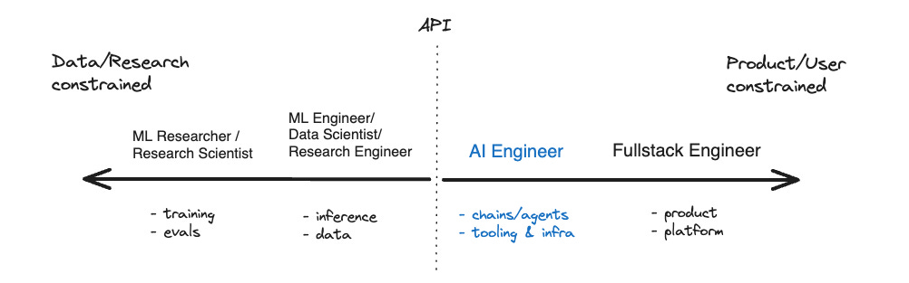
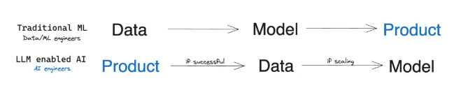
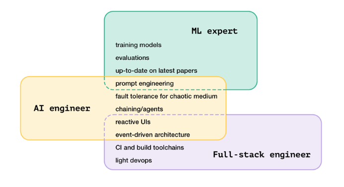

## 1 The Rise of the AI Engineer

2013年，完成一个AI任务需要耗费整个研究团队5年的时间。而时间来到撰写这篇文章的2023年，你只需要一份 API 文档和一个空闲的下午。

### 1.1 The AI Engineer's Spectrum

* Swyx 绘制了一张岗位光谱图，👈 左侧受到数据/研究约束 (Data/Research constrainted) ，👉 右侧受到产品/用户约束 (Product/User constrainted) ；最左侧岗位与机器学习 (ML) 密切相关，最右侧岗位已经不涉及 ML 技能。划分边界就是 API (大模型调用接口) 。

* 目前，底层大模型已经爆发，生成式AI应用也有爆发趋势。两端同时爆发，必将催生大量的人才需求。普通公司受限于人才和算力无法参与大模型训练，因此机会主要在右侧。

* 因此，大多数公司生存逻辑转变为使用AI能力做出产品。这意味着公司不需要再配备庞大的 ML 算法团队，而是专注于调用大模型 API 并进行产品化。这就是 AI Engineer (人工智能工程师)

### 1.2 新的需求催生新的岗位
* 不同于 Prompt Engineer 成为各岗位兼具的基础技能，AI Engineer 必须是全职岗位，因为要处理的挑战又多又关键：
  * ① 测评源源不断的开/闭源大模型，
  * ② 尝试最新的技术框架和技术产品，
  * ③ 紧跟论文/融资/产品/活动等行业动态……

* AI Engineer 正在将AI的进步，转化为数百人可以使用的产品。他们可能是独立开发者，可能是一个小型创业团队，可能在知名创业公司 (比如 HeyGen、Figma、Notion)，也可能身在微软、谷歌等科技巨头。

* AI Engineer 是软件工程衍生出的新分支，专门研究AI的应用并有效运用新兴的技术栈。新岗位的出现，源自平台转换带来的代际变革，曾经的 DevOps 工程师、数据工程师等也是这样。

## 2 Swyx坚信 AI Engineer 是未来十年需求最旺盛的工程师岗位

### 2.1 AI Engineer vs. ML Engineer
* AI Engineer 更多处于0到1的阶段，而 ML Engineer 更多处于1到N的阶段。

* AI Engineer 更多地思考产品，ML Engineer 要处理具体的端到端问题 (基于 baseline 为某个特性问题构建或优化模型，实现具体的数据目标)。

* AI Engineer 的世界由模型开始，到产品结束，更接近全栈开发；ML Engineer 世界从模型开始，到模型结束，数学要非常好。

* AI Engineer 是一种新的人才和技能组合，既融合了 ML Engineer 的部分特质，又借鉴了全栈开发的技能要求，同时也很注重产品能力。一般来说，拥有的 ML Engineer 技能越多，作为 AI Engineer 就越成功。

* 在一个成熟团队里，AI Engineer 和 ML Engineer 的比例大约是四比一。

* 换个角度理解，AI Engineer 承包了 ML Engineer 工作中与模型无关的部分，使得 ML Engineer 有余力和能力去研究模型。或者说，市场并没有足够多的 ML Engineer 储备，因此需要一个新的角色来填平各方的需求。

### 2.2 fire-ready-aim

* 传统机器学习工作流是 aim - ready - fire，要求 Data / ML Engineer 先收集数据、再训练模型、最后投入生产。

* 基于AI的 LLM 工作流是 fire - ready - aim， AI Engineer 先使用提示词快速构建和验证产品创意，再获取特定数据进行微调。不仅速度快，而且成本低 (只有传统工作流的千分之一到万分之一)。

* 在小团队里，AI Engineer 可以胜任产品经理的职能，洞察客户需求，并为产品选择正确的方向。

* 在大团队里，产品经理依然无可替代，这时 AI Engineer 负责提供基础模型的最新动态，并与产品经理一起，通过提示词来快速验证产品创意是否可行。

## 3 How to become to AI Engineer
### 3.1 AI Engineer 转型

* 生成式AI正在迫使软件工程师去贴近产品开发。

* 未来，大模型能力一旦突破某个临界点，软件工程师的编程能力将基本被AI取代。届时，软件工程师的竞争优势就变成了：对AI模型的功能进行巧妙的组合，打造有趣的产品，推进公司的发展目标。

* 如果这个预测成真，那么技能栈越广泛的工程师，将越受欢迎。

### 3.2 AI Engineer 上岸

* 如果用一句话概括 AI Engineer 的工作内容，那就是：探索如何把AI融入到产品中。

* 如果想向进一步了解 AI Engineer 的日常工作和所需技能，可以从这个清单开始：
  * 围绕大语言模型 (LLM) 构建系统和功能。理解和使用大语言模型，并绕过遇到的各种限制，把相关上下文有效地融入到发送给 LLM 的消息中。
  * 向产品团队和领导阐释生成式AI带来的机遇。
  * 与机器学习工程师合作，有效评估模型性能。
  * 协助制定执行团队的战略。
  * 与工程负责人共同制定产品路线图和开发顺序。
  * 大量的实际编程工作，包括后端和前端开发，将创意变为产品功能。

* 一年时间里，作者做了以下这些事情： 
  * 创建 Proof of Concepts (概念验证，可以理解为 Demo)，并勇敢对外分享。比如参加黑客松比赛。
  * 积极分享，参与并引导主题讨论。比如，在 Slack 创建相关频道并分享不错的文章、论文，或者分享在GitHub 和 Hugging Face 上制作小原型。
  * 与决策者沟通对话，提供有价值的见解和可行方案。比如，借鉴某产品的AI功能实现方式，或者引入新的AI框架或者开发工具，并帮助他们理解如何应用新技术。
  * 快速行动，积极参与产品的构建和发布。作者在公司内部开展了名为 Guide Book 的AI项目，用6周时间突破障碍并最终发布，取得了非常不错的成绩。
  * 回到初学者心态。转型就意味着走出舒适圈，重新经历困惑和痛苦。这对于资深开发者来说还是很有挑战的。
  * 模型评估是最有挑战性且至关重要的核心技能。
  * 与业界分享经验。积极参与大型活动并争取发言机会，并借此结识更多同行者。
* 必学清单：
  * 1. 坚定职业选择的信心
    * [我如何成为一名机器学习从业者](https://blog.gregbrockman.com/how-i-became-a-machine-learning-practitioner)
    * [是时候成为一名机器学习工程师了](https://blog.gregbrockman.com/its-time-to-become-an-ml-engineer)
  * 2. 理解机器学习基本概念
    * [百页机器学习](https://www.amazon.co.uk/Hundred-Page-Machine-Learning-Book/dp/199957950X)
    * [线性代数的本质](https://www.youtube.com/watch？v=kjBOesZCoqc&list=PL0-GT3co4r2y2YErbmuJw2L5tW4Ew2O5B)
  * 3. LLM爆发带来的机会
    * [文本是通用接口](https://scale.com/blog/text-universal-interface)
    * [LLM应用的新兴架构](https://a16z.com/emerging-architectures-for-llm-applications)
  * 4. LLMs及其工作原理介绍
    * [图解 Transformer](https://jalammar.github.io/illustrated-transformer)
    * [Attention Is All You Need](https://arxiv.org/pdf/1706.03762)
    * [Andrej Karpathy Youtube](https://www.youtube.com/@AndrejKarpathy/videos)
    * [What Is ChatGPT Doing … and Why Does It Work](https://writings.stephenwolfram.com/2023/02/what-is-chatgpt-doing-and-why-does-it-work)
  * 5. Fine-tuning LLMs
    * [Fine Tuning](https://adamfallon.com/2024/01/30/experiments-in-llms-episode-1-fine-tuning)
  * 6. Vector DB + Embedding
    * [Memory - Vector DBs and Embedding](https://adamfallon.com/2024/01/30/experiments-in-llms-episode-2-memory-vector-dbs-and-embeddings)

## 4 The AI Engineer Skillset
### 4.1 招聘角度的AI Engineer 的最佳技能组合
[Elicit AI](https://elicit.com/)

[How To Hire AI Engineers](https://blog.elicit.com/how-to-hire-ai-engineers/)

* 一位出色的 AI Engineer 可以把看似对立的特质融合起来：既能了解模型能力边界并对其留有敬畏，也能理解不完美的现状，并基于此构建弹性和高性能的系统。

* [必备技能1] 传统的软件工程技能，特别是在复杂的、数据密集型应用程序上的后端工程经验
  * 在大规模应用中的专业、实战经验
  * 在几个后端 Web 框架上的深入、实践经验
  * 一定的 DevOps 知识和对基础设施最佳实践的理解
  * 队列、消息总线、事件驱动和无服务器架构等等方面拥有丰富的工具箱

* [必备技能2] 对语言模型能力，有着真正的好奇心和热情
  * 在以有趣方式使用语言模型，并且有一个或多个比价正式的项目 
  * 具备一定程度的分解认知能力，例如把问题分解后，知道哪些任务可以交给语言模型，哪些要保留在传统的启发式和计算能力领域 
  * 对 ML 有一定的了解，以便跟机器学习工程师或机器学习专家等进行沟通

* [必备技能3] 理解使用大模型带来的挑战，形成防御性、故障优先的思维方式
  * 仔细而有原则地处理错误情况、异步代码、流式数据、缓存、日志记录和分析，了解生产环境中的行为 
  * AI Engineer 即使在相对较小的规模上工作时，也需要培养防御性、故障优先的思维方式

[AI Engineer JD](https://elicit.com/careers?ashby_jid=d27d51d7-b318-4cb0-9b88-c37de18905f3)
[How to hire AI Engineer](https://www.latent.space/p/hiring)

## 5 AI Engineer 阅读清单
[Elicit Machine Learning Reading List](https://github.com/elicit/machine-learning-list)

* 基础知识
  * 机器学习入门 
  * Transformers 
  * 基础模型结构 
  * 训练与微调 

* 推理与执行策略 
  * 情境推理 In-context reasoning 
  * 任务分解 Task decomposition 
  * 辩论策略 Debate 
  * 工具应用与辅助 
  * Honesty， factuality， and epistemics

* 应用领域 
  * 科学研究 
  * 预测分析 
  * 搜索与排序

* 机器学习实践
  * 实际部署 
  * 性能评估 
  * 数据集管理

* 高级议题
  * 世界观模型与因果关系 
  * 决策规划 
  * 不确定性处理、模型校准与主动学习 
  * 模型可解释性与调整 
  * 强化学习技术

* 宏观视角
  * AI的扩展与应用 
  * AI的安全性问题 
  * AI对经济和社会的影响 
  * AI哲学思考

## 6 AI Engineer 的面试
[What We've Learned From A Year of Building with LLMs](https://applied-llms.org/)
[AI Engineer interview](https://eugeneyan.com/writing/how-to-interview)

### 6.1 AI Engineer 的技术能力
* 具备基本的软件工程能力。通过编程任务，判断候选人是否能逻辑地分解问题，编写清晰、易读、可维护的代码，考虑到边界情况，对反馈反应良好等。 
  * 检查 2D/3D 数组是否满足预定义条件，处理边界情况，并编写单元测试 
  * 实现并启动一个推理端点，包括输入/输出验证、日志记录、监控和更新端点状态的命令 
  * 构建一个数据处理管道，先实现批处理，然后改造为流处理

* 数据素养是至关重要但常被忽视的技能。核心包括理解并尊重数据、精通数据分析，以及在数据或分析结果可疑时的敏锐直觉。 
  * 你是如何处理数据的？遇到了哪些问题，又是如何解决的？ 
  * 你遇到过哪些具有误导性的汇总统计？哪些统计更有用？ 
  * 你创建过哪些有见地的数据可视化，为什么？哪些可视化效果不佳？

* 能够适应不透明模型的输出。能够接受我们无法完全控制或解释大多数模型，并且所有模型都会反映其训练数据中的偏见。
  * 你遇到过哪些意外或有偏见的输出？如果需要，你是如何处理的？ 
  * 你在模型周围设置了哪些防护措施或策略，以确保其与用户需求一致？ 
  * 如果你发现模型中出现了偏见，你会如何缓解？

* 理解基本的评估方法。虽然 AI Engineer 不直接训练模型，但也有责任评估所使用的模型。 
  * 你如何随着模型的重新训练或更新来衡量其性能？ 
  * 当模型性能突破预定阈值时，你会如何应对？ 
  * 你是如何收集初始评估数据并构建评估框架的？

### 6.2 AI Engineer 的非技术能力
* 面试高级职位时，还需要从非技术方面进行考察，可以从以下4个维度来进行评估:
  * 模糊性：候选人开始工作时问题的不明确程度 
  * 影响力：候选人通过协作来推动影响的范围 
  * 复杂性：问题本身的错综复杂程度 
  * 执行力：候选人在有限资源和时间内交付成果的能力

* 大多数技术技能是可以培养的，而主人翁意识、资源调配能力和坚韧不拔的毅力这类特质可能只能靠招聘。

* 一个主观观点：强有力的人才应具备的核心特质包括渴望、判断力、同理心。