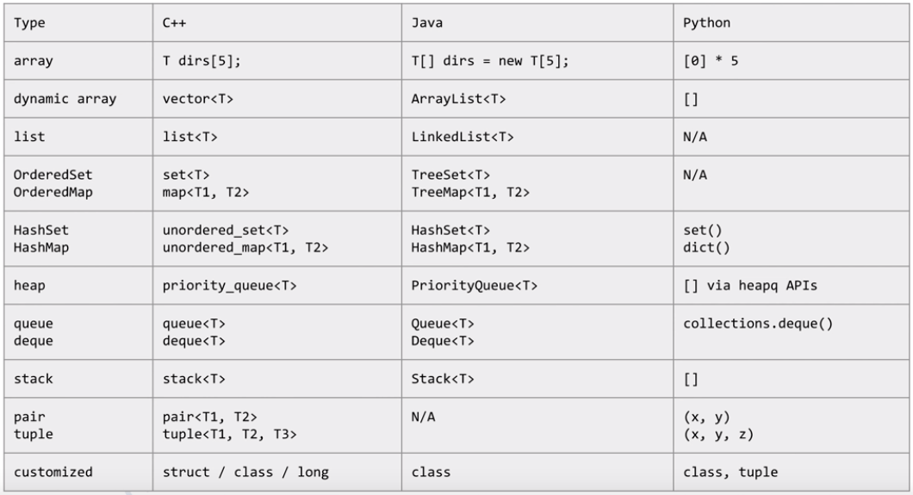
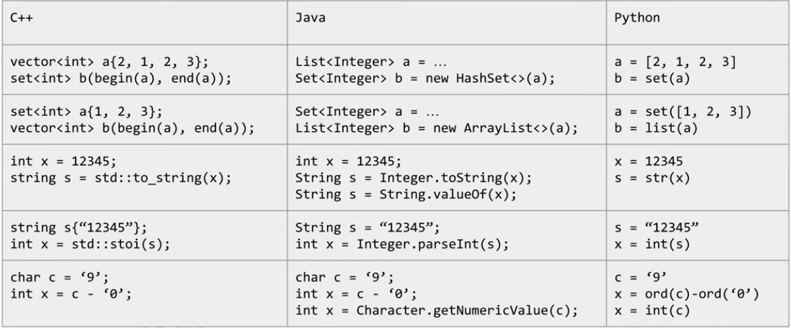
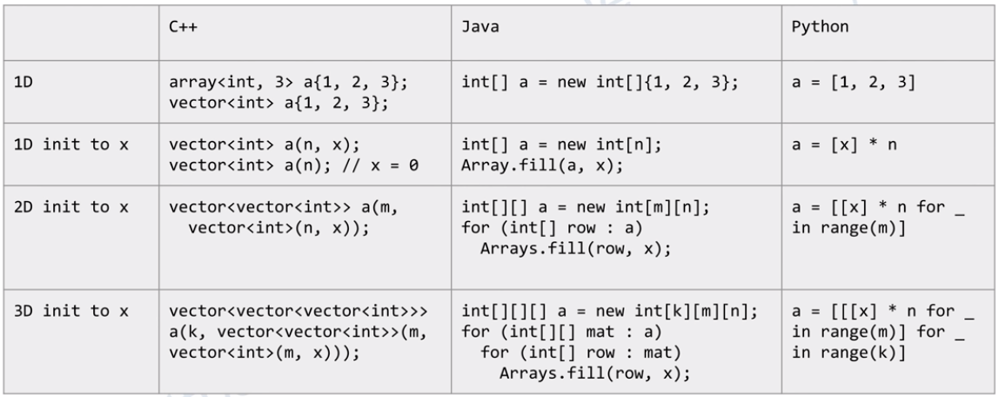
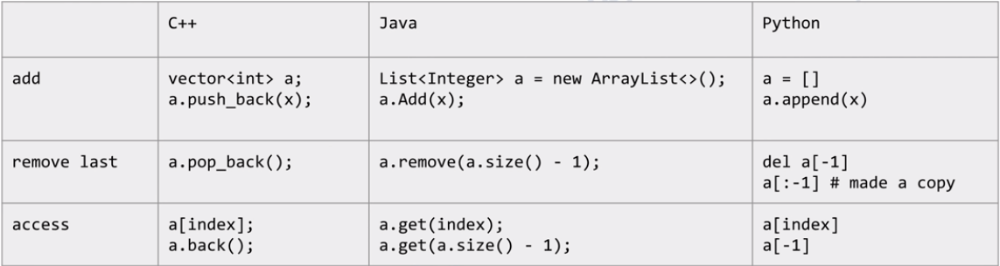
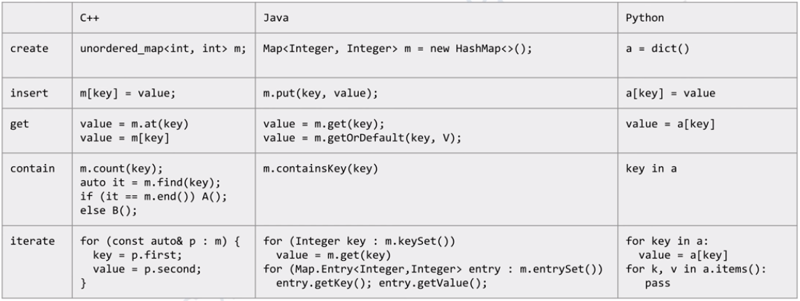
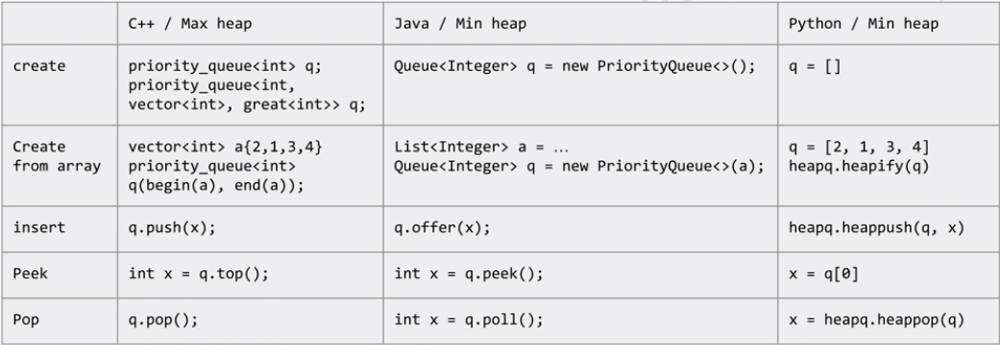

#### C++, Java和Python的各种数据结构和APIs
总体比较

构造函数

* Array

* Dynamic Array

* LinkedList

* TreeSet / TreeMap

* HashSet / HashMap

* Heap / Priority Queue

* Deque / Queue / Stack

* Pair / Tuple

* Customized Data Structure

