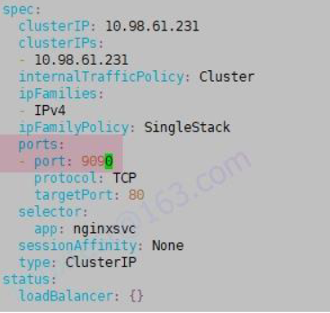

## Core Concepts

## Configuration

## Multi-container Pods
1. SideCar
2. Adapter
3. Ambassador

## Obervability

## POD Design

## Services and Networking

## State Persistance

## Others

## 1. CronJob - 1
参考文档1：[依次点击：Tasks -> Run Jobs -> Running Automated Tasks with a CronJob](https://kubernetes.io/docs/tasks/job/automated-tasks-with-cron-jobs/)

参考文档2：[依次点击：Concepts -> Workloads -> Workload Resources -> Jobs](https://kubernetes.io/docs/concepts/workloads/controllers/job/)

```shell
kubectl config use-context k8s

# 1. 创建 CronJob
vim cronjob-1.yaml
```

```shell
# 创建 CronJob
kubectl apply -f cronjob-1.yaml
# 检查 CronJob
kubectl get cronjob

# 2. 手动触发 CronJob
kubectl create job ppi-test --from=cronjob/ppi
# 查看这个 job
kubectl get jobs
```
## 2. CronJob - 2
参考文档1：[依次点击：Tasks -> Run Jobs -> Running Automated Tasks with a CronJob](https://kubernetes.io/docs/tasks/job/automated-tasks-with-cron-jobs/)

参考文档2：[依次点击：Concepts -> Workloads -> Workload Resources -> Jobs](https://kubernetes.io/docs/concepts/workloads/controllers/job/)

```shell
kubectl config use-context k8s

# 按照题目要求，修改 yaml 文件
vim /ckad/CKAD00016/periodic.yam
```

```shell
# 创建 Cronjob
kubectl apply -f /ckad/CKAD00016/periodic.yaml
# 检查 Cronjob 和 job，确保至少有一个 hello-****的 job（创建后，需要等一分钟，才会执行）
kubectl get cronjobs hello
kubectl get jobs
```

## 3. Dockerfile
```shell
# kubectl config use-context k8s

docker -h

# 1. 构建镜像
cd /ckad/DF/
sudo docker build -t centos:8.2 . # 切换到 Dockerfile 文件所在的目录做，注意命令最后还有一个小数点，表示当前目录

# 检查镜像
sudo docker images | grep centos | grep 8.2

# 2. 导出新镜像 centos:8.2，并保存到/ckad/DF/centos-8.2.tar
sudo docker save centos:8.2 > /ckad/DF/centos-8.2.tar

# 检查存储的镜像
ll /ckad/DF/centos-8.2.tar
```

## 4. 限制CPU和内存 - 1
参考文档：[依次点击：Concepts -> Configuration -> Resource Management for Pods and Containers](https://kubernetes.io/docs/concepts/configuration/manage-resources-containers/)

```shell
kubectl config use-context k8s

vim nginx-resources.yaml
```

```shell
kubectl apply -f nginx-resources.yaml
```

## 5. 限制CPU和内存 - 2
参考文档：[依次点击：Concepts -> Configuration -> Resource Management for Pods and Containers](https://kubernetes.io/docs/concepts/configuration/manage-resources-containers/)

```shell
kubectl config use-context k8s

# 先查看 namespace haddock 的 LimitRange 详情（这个查询命令，要背过）
kubectl describe ns haddock
# 或者使用下面两条命令查看详情
kubectl -n haddock get limitrange
kubectl -n haddock get limitrange xxxxxxxxx -o yaml
# 可见 namespace haddock 设置的最大内存为 40Mi，一半就是 20Mi。（注意，是看 Max，不是看 Min。)

# 方法 1：直接在线修改
kubectl -n haddock edit deployments.apps nosql
```

```shell
# 检查一下，确保修改成功了。
kubectl -n haddock describe deployment nosql

# 方法 2：使用 yaml 文件，重新创建

# 修改 Deployment nosql 的内存限制，先删除原来的。
# 备份一下文件，防止改错了。
cp /ckad/chief-cardinal/nosql.yaml nosql.yaml-bak
# 删除原先的 deployment
kubectl delete -f /ckad/chief-cardinal/nosql.yaml
# 或者
kubectl -n haddock delete deployments.apps nosql
vim /ckad/chief-cardinal/nosql.yaml
```

```shell
# 重新创建
kubectl apply -f /ckad/chief-cardinal/nosql.yaml
# 检查一下，确保修改成功了。
kubectl -n haddock describe deployment nosql

```

## 6. 运行旧版应用程序
```shell
kubectl config use-context k8s

kubectl explain deployment.spec
kubectl explain deployment.spec.selector

vim /ckad/credible-mite/www.yaml
```

```shell
# 创建
kubectl apply -f /ckad/credible-mite/www.yaml
# 检查
kubectl -n garfish get all
```

## 7. Canary金丝雀发布
```shell
kubectl config use-context k8s

kubectl scale -h

cp /ckad/goshawk/current-chipmunk-deployment.yaml bak.yaml
vim /ckad/goshawk/current-chipmunk-deployment.yam
```

```shell
kubectl apply -f /ckad/goshawk/current-chipmunk-deployment.yaml
# 总共 10 个 Pod，将 60%流量给当前版本 Pod，就是 current-chipmunk-deployment 扩容至 6 个 pod
kubectl scale deployment current-chipmunk-deployment --replicas=6 -n goshawk
# 将 40%流量给金丝雀版本 Pod，就是 canary-chipmunk-deployment 扩容至 4 个 pod
kubectl scale deployment canary-chipmunk-deployment --replicas=4 -n goshawk
# 注意，如果考试时，有可能考将 20%流量给金丝雀版本 Pod，那就是原先为 8 个，金丝雀为 2 个，要变通。

# 检查
kubectl get pod -n goshawk
```

## 8. 配置Container安全上下文
参考文档：[依次点击：Tasks -> Configure Pods and Contaienrs -> Configure a Security Context for a Pod or Container](https://kubernetes.io/docs/tasks/configure-pod-container/security-context/)

```shell
kubectl config use-context k8s

kubectl edit deployment broker-deployment -n quetzal
```


## 9. 创建Deployment并指定环境变量
参考文档(Optional)：[依次点击：Concepts -> Tasks -> Inject Data Into Applications -> Define Environment Variables for a Container](https://kubernetes.io/docs/tasks/inject-data-application/define-environment-variable-container/)

```shell
kubectl config use-context k8s

# 下面命令背过，如果不会，就使用 kubectl -h 来帮助。
kubectl create deployment api --image=nginx:1.16 --replicas=6 -n ckad00014 --dry-run=client -o yaml > api.yaml

vim api.yaml
# 在 containers:里的 image:和 name:下添加
```

```shell
kubectl apply -f api.yaml
```

## 10. RBAC授权
参考文档(Optional)：[依次点击：Reference -> API Access Control -> Using RBAC Authorization](https://kubernetes.io/docs/reference/access-authn-authz/rbac/)

```shell
kubectl config use-context k8s

# 1、通过 logs 打印错误日志
kubectl -n gorilla get pod
kubectl -n gorilla logs honeybee-deployment-***
# 2
# 检查现有的 serviceaccount
kubectl -n gorilla get sa
# 查看 rolebinding 和 role 的绑定
kubectl -n gorilla get rolebinding
# 通过 rolebinding，查看 role 和 serviceaccount 的绑定
kubectl -n gorilla describe rolebinding
# 检查 role，寻找有 get 或 list 权限的 role
kubectl -n gorilla describe role
# 通过上面的一系列操作，检查发现，gorilla-role 符合题目的要求，它对应的 serviceaccount 是 gorilla-sa

# 3、设置 honeybee-deployment 的 serviceaccount
# （in exam，其实就是跟题目里的 namespace 相同的那个 sa 是正确的。对应这道模拟题，就是 gorilla-sa 是正确的）
kubectl -n gorilla set serviceaccount deployments honeybee-deployment gorilla-sa

# 等 2 分钟，会自动生成一个新 pod，再次检查，不报错了
kubectl -n gorilla logs honeybee-deployment-***
```

## 11. ConfigMap
参考文档：[依次点击：Concepts -> Configuration -> ConfigMaps](https://kubernetes.io/docs/concepts/configuration/configmap/)

```shell
kubectl config use-context k8s

kubectl create configmap some-config --from-literal=key3=value4

vim nginx-configmap.yaml

#添加如下内容
apiVersion: v1
kind: Pod
metadata:
  name: nginx-configmap
spec:
  containers:
  - name: nginx-configmap
    image: nginx:stable
    volumeMounts:
    - name: config
      mountPath: "/some/path"
  volumes:
  - name: config
    configMap:
    name: some-config


kubectl apply -f nginx-configmap.yaml

# 检查
kubectl exec -it nginx-configmap -- /bin/bash
cat /some/path/key3
```

## 12. Secret
参考文档：[依次点击：Concepts -> Configuration -> Secrets](https://kubernetes.io/docs/concepts/configuration/secret/)

```shell
kubectl config use-context k8s

kubectl create secret generic another-secret --from-literal=key1=value2

vim nginx-secret.yaml
```

```shell
kubectl apply -f nginx-secret.yaml
# kubectl describe po nginx-secret 可以看到Environment引用情况
```

## 13. Pod健康检查 livelinessProbe
参考文档：[依次点击：Tasks -> Configure Pods and Containers -> Configure Liveness, Readiness and Startup Probes](https://kubernetes.io/docs/tasks/configure-pod-container/configure-liveness-readiness-startup-probes/)

```shell
kubectl config use-context dk8s

# 1. 检查集群 dk8s 下的所有命令空间里的 Pods，找出 Liveness probe 问题的 Pod。
kubectl get pods -A
# 对所有 namespace 下的 pod 逐一检查，考试时，你切换集群后，只会有 5 个 pod 需要你检查，不会像模拟环境里这么多的。
# Message column下面
kubectl describe pod probe-demo -n probe-ns |tail

echo probe-ns/probe-demo > /ckad/CKAD00011/broken.txt

# 2.
kubectl get events -n probe-ns -o wide |grep probe-demo > /ckad/CKAD00011/error.txt

# 3.
kubectl get pods probe-demo -n probe-ns -o yaml > probe.yaml
cp probe.yaml bak-probe.yaml
kubectl delete -f probe.yaml

vim probe.yaml
# 修改 livenessProbe:字段下的 port 为 8443。
port: 8443
# 重新创建此 Pod
kubectl apply -f probe.yaml

# 检查
kubectl describe pod probe-demo -n probe-ns |tail

```

## 14. Pod健康检查 readinessProbe
参考文档：[依次点击：Tasks -> Configure Pods and Containers -> Configure Liveness, Readiness and Startup Probes](https://kubernetes.io/docs/tasks/configure-pod-container/configure-liveness-readiness-startup-probes/)

```shell
kubectl config use-context dk8s

kubectl edit deployment probe-http

# 在 image 或者 name 下面添加，注意空格对齐位置。
```

```shell
# 检查，确保pod probe-http-*** 已经变成 Running 状态。
kubectl get pod
```

## 15. 升级与回滚
参考文档：[依次点击：Concepts -> Workloads -> Workload Resources -> Deployments](https://kubernetes.io/docs/concepts/workloads/controllers/deployment/)

```shell
kubectl config use-context k8s

kubectl edit deployment webapp -n ckad00015
# 按照题目要求，修改红框中的内容
maxSurge 和 maxUnavailable 可以是数字，也可以是百分比，请根据题目的要求写
```

```shell
# 先检查一下之前的 image 版本，为 lfccncf/nginx:1.12.2
kubectl -n ckad00015 get deployments webapp -o yaml|grep image

# 更新为 lfccncf/nginx:1.13.7，这里的 nginx=其中的 nginx 是 containers 的 name 字段。如上图划线处。
kubectl set image deployment webapp nginx=lfccncf/nginx:1.13.7 -n ckad00015

# 或者 kubectl set image deployment webapp nginx=lfccncf/nginx:1.13.7 -n ckad00015 --record
# 注意，这里加不加--record 都行，加上，则下面第 3 步的 rollout history 描述里会是命令，不加，则下面第 3 步的 rollout history 描述里就是<none>
# 再次检查，image 为 1.13.7 了。
kubectl -n ckad00015 get deployments webapp -o yaml|grep image

如果需要看历史，则可以使用下面这条命令
# kubectl -n ckad00015 rollout history deployment webapp

# 回滚
kubectl rollout undo deployment webapp -n ckad00015

# 或者 kubectl rollout undo deployment webapp -n ckad00015 --to-revision=1
#--to-revision 指定回滚的版本，其实，这里指不指定都行，一共就两个版本，1 为 lfccncf/nginx:1.12.2，而 2 为 lfccncf/nginx:1.13.7

# 再检查，image 为 1.12.2 了。
kubectl -n ckad00015 get deployments webapp -o yaml|grep image
```

## 16. Deployment使用ServiceAccount
```shell
kubectl config use-context k8s

# 检查 deployment 的名字
kubectl -n frontend get deployment
# 开始更新
kubectl -n frontend set serviceaccount deployments frontend-deployment app

# 检查 Service Account
kubectl -n frontend describe deploy frontend-deployment
```

## 17. 更新Deployment并暴露Service
```shell
kubectl config use-context k8s

# 1. Task1
kubectl get deployment ckad00017-deployment -n ckad00017 -o yaml > ckad00017.yaml
cp ckad00017.yaml bak-ckad00017.yaml
kubectl delete -f ckad00017.yaml

vim ckad00017.yaml
```

```shell
kubectl apply -f ckad00017.yaml
# 检查
kubectl get pod -n ckad00017 --show-labels

# 2. Task2
# 先确认 pod 容器的端口，就是下面命令--target-port=的端口，检查后发现是81.
kubectl -n ckad00017 get deployments ckad00017-deployment -o yaml|grep -i "containerPort:"

kubectl -n ckad00017 expose deployment ckad00017-deployment --name=rover --protocol=TCP --port=81 --target-port=81 --type=NodePort

# 检查
kubectl -n ckad00017 get svc
curl 10.103.95.21:81
```

## 18. NetworkPolicy
参考文档：[依次点击：Concepts -> Services, Load Balancing, and Networking -> Network Policies](https://kubernetes.io/docs/concepts/services-networking/network-policies/)

```shell
kubectl config use-context nk8s

# 不需要你写 NetworkPolicy，但是考试中会有多个 NetworkPolicy 供你选择出正确的。在所有的 NetworkPolicy 的 yaml 文件中导找，
# 找 ingress 和 egress 都有标签 podSelector 的，那么这个 NetworkPolicy 就是正确的。那么 podSelector 里面的标签就是要给 pod 打上的正确标签。

# 1、先检查所有的 networkpolicy 和 pod 标签
# 通过查看所有 networkpolicy 得知，
# front 和 db 各有一个 networkpolicy，ckad00018-newpod 没有 networkpolicy。
# 所以查看 front 和 db 的 networkpolicy 标签，把可以跟他们互通的标签，设置给 ckad00018-newpod
kubectl -n ckad00018 get networkpolicy
kubectl -n ckad00018 get networkpolicy access-front -o yaml

kubectl -n ckad00018 get networkpolicy access-db -o yaml

kubectl -n ckad00018 get pod --show-labels

# 2、给 ckad00018-newpod 打正确的标签 (考试中是api-access而不是db-access)
kubectl label pod -n ckad00018 ckad00018-newpod front-access=true
kubectl label pod -n ckad00018 ckad00018-newpod db-access=true

# 再次检查标签
kubectl -n ckad00018 get pod --show-labels
```
## 19. Ingress排错 - 1
参考文档：[依次点击：Concepts -> Services, Load Balancing, and Networking -> Ingress](https://kubernetes.io/docs/concepts/services-networking/ingress/)

```shell
kubectl config use-context nk8s

vim /ckad/CKAD202206/ingress.yaml

# 记住 Deployment 的 labels 标签，因为题目说明了 Deployment 是正确的
# 记住 Deployment 的容器的端口号，因为题目说明了 Deployment 是正确的。
```


```shell
# 创建
kubectl apply -f /ckad/CKAD202206/ingress.yaml

# 检查
kubectl -n ingress-ckad get pod,svc,ingress -o wide
```

## 20. Ingress排错 - 2
参考文档：[依次点击：Concepts -> Services, Load Balancing, and Networking -> Service](https://kubernetes.io/docs/concepts/services-networking/service/)

```shell
kubectl config use-context k8s

# 先检查这道题里的 ingress 和 deployment，以及 service，这三项哪里有问题。
kubectl -n ingress-kk get all

# 查看 ingress，记下 service 的 name 和 port 的 number。
kubectl -n ingress-kk get ingress -o yaml

# 查看 deployment，记下 ports 的 containerPort
kubectl -n ingress-kk get deployments -o yaml

# 创建 service
vim kk-svc.yaml
```

```shell
# 创建 service
kubectl apply -f kk-svc.yaml
# 检查
kubectl -n ingress-kk get pod,svc,ingress -o wide
curl <ingress 的 ip 地址>
# 返回提示：Hello World ^_^
```

## 21. Service、ConfigMap、Sidecar
参考文档：[依次点击：Concepts -> Configuration -> ConfigMaps](https://kubernetes.io/docs/concepts/configuration/configmap/)

```shell
kubectl config use-context k8s

kubectl edit svc nginxsvc -n default
# 修改为 port: 9090, 注意，不是修改 targetPort
```

```shell
# 检查
kubectl get svc -n default

# 创建 configmap
kubectl create configmap haproxy-config --from-file=/ckad/ambassador/haproxy.cfg -n default

kubectl -n default get pod poller -o yaml > poller.yaml
cp poller.yaml bak-poller.yaml
kubectl delete -f poller.yam

vim poller.yaml
# 注意图片浅蓝色的部分。如果考试时，已经给你挂载好了，就不要重复挂载了。否则会报错。如果没有挂载，则需要手动写上去。
```

```shell
# 创建
kubectl apply -f poller.yaml

# 检查
kubectl get pod poller -n default
kubectl get svc -n default
curl 10.98.61.231:9090
```

## 22. Deployment修改镜像
```shell
kubectl config use-context nk8s

# 检查 pod，找到 ImagePullBackOff 或 ErrImagePull 报错的。（hello-和 ppi-开始的pods是前面题目 CronJob相关的pods，忽略即可）
kubectl get pods -n default

# 通过查出来的 pod，去编辑它的 deployment。
kubectl edit deployment deploy-nk8s -n default
# 修改 image:为正确的镜像，比如改为 image: nginx

# 再次检查，显示 Running 了
kubectl get pods -n default
```

## 23. PV/PVC
参考文档：[依次点击：Tasks -> Configure Pods and Containers -> Configure a Pod to Use a PersistentVolume for Storage](https://kubernetes.io/docs/tasks/configure-pod-container/configure-persistent-volume-storage/)

```shell
kubectl config use-context sk8s

# 从 node01 上 ssh 跳转到 node02 上
ssh node0
echo WEPKEY=7789 > /opt/KDSP00101/data/index.html

vim task-pv-volume.yaml
```

```shell
kubectl apply -f task-pv-volume.yaml

vim task-pv-claim.yaml
```

```shell
kubectl apply -f task-pv-claim.yaml

# 因为 Kubernetes supports hostPath for development and testing on a single-node cluster.
# 所以，测试环境里，需要指定 Pod 在 node02 上运行，即，与 hostPath 类型的 PV 在同一个节点上。
# 考试环境，一般只有一个 node 节点，所以不需要指定。但是最好你考试时，kubectl get node 先检查一下，如果有多个 node 节点，则也需要指定 Pod 在创建 PV
# 的那个节点上运行，即，使用 nodeSelector。
vim task-pv-pod.yaml
```

```shell
kubectl apply -f task-pv-pod.yaml

测试
kubectl get pod -o wide | grep task-pv-pod
curl 10.244.2.35

# 退回到 node01
exit
```

## 24. Pod多容器 - sidecar
参考文档：[依次点击：Concepts -> Cluster Administration -> Logging Architecture](https://kubernetes.io/docs/concepts/cluster-administration/logging/)

```shell
kubectl config use-context k8s

cp /ckad/KDMC00102/fluentd-configmap.yaml bak-2.yaml
vim /ckad/KDMC00102/fluentd-configmap.yaml
# 考试中，这个 fluentd-configmap.yaml 文件一般是正确的，一般不需要你载更改。模拟环境为了让你了解原理，所以故意写错了。
```

```shell
kubectl apply -f /ckad/KDMC00102/fluentd-configmap.yaml

vim sidecar.yaml
```

```shell
# 创建
kubectl apply -f sidecar.yaml
# 检查
kubectl get deploy,pod | grep deploymenb-web
# 检查
kubectl exec deploymenb-web-857b985b8b-zmcfj -c adaptor-dev -- tail /ckad/log/input.log
```

## 扩展
[CheatSheet](https://kubernetes.io/zh-cn/docs/reference/kubectl/cheatsheet/)
### 1. 资源配额 Quota

```shell
# 在 qutt 命名空间，创建一个名为 myquota 的 Quota ，该资源 Quota 具有 1 个 CPU，1G 内存和 2 个 pod 的硬限制。
vim quota.yaml
```

```shell
kubectl create -f quota.yaml
```
### 2. SecurityContext

```shell
# 在 test 命名空间，有一个名为 secnginx 的 pod，修改此 pod，为容器添加 CAP_NET_ADMIN 和 CAP_SYS_TIME 权能。

kubectl get pod -n test secnginx -o yaml > secnginx.yaml
cp secnginx.yaml bak-secnginx.yaml
kubectl delete -f secnginx.yaml
vim secnginx.yaml
```

```shell
kubectl apply -f secnginx.yaml
```

### 3. Secret private Key


```shell
# 在 test 命名空间，创建一个名为 mysecret 的密钥，其值 username 为 devuser 和 password 为 A!B\*d$zDsb=
# 在 test 命名空间，创建一个 pod，镜像使用 nginx: 1.16，名字为 mypod，将秘密 mysecret 挂载到路径 /etc/foo 上的卷中。
kubectl create secret generic mysecret --from-literal=username=devuser --from-literal=password='A!B\*d$zDsb=' -n test
vim mypod.yaml
```

```shell
kubectl apply -f mypod.yaml
```
### 4. Jobs

```shell
kubectl config use-context k8s

# 创建 job
vim busybox-job.yaml
```

```shell
# 创建
kubectl apply -f busybox-job.yaml
# 查看此 job 和 pod
kubectl get jobs busybox-job
kubectl get po busybox-job-*****
# 查看 Job 日志
kubectl logs job/busybox-job
```
