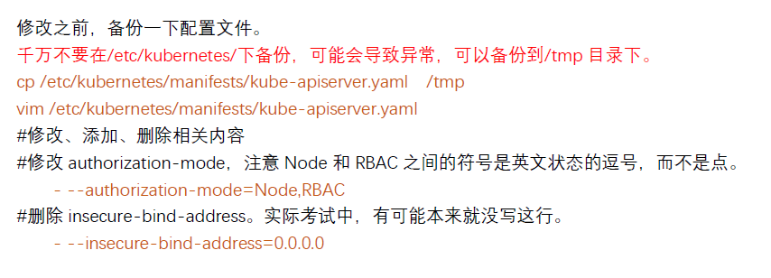
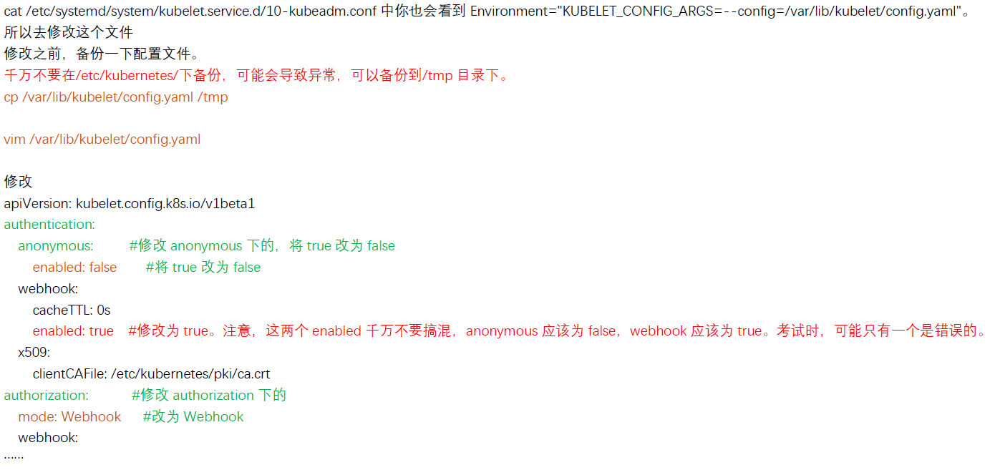

## 1. kube-bench 修复不安全项
参考文档1：[依次点击：Tasks -> Run Jobs -> Running Automated Tasks with a CronJob](https://kubernetes.io/docs/reference/config-api/kubelet-config.v1beta1/)

```shell
kubectl config use-context KSCS00201

# 1. 切换到 Master 的 root 下
ssh master01
sudo -i

# sh kube-bench.sh # 模拟

# 2. 修改 api-server

# 3. 修改 kubelet

# 修复
# 检查 kubelet 配置文件位置。
systemctl status kubelet

# cat /etc/systemd/system/kubelet.service.d/10-kubeadm.conf 中也会看到 Environment="KUBELET_CONFIG_ARGS=--config=/var/lib/kubelet/config.yaml"。
# 所以去修改这个文件
# 修改之前，备份一下配置文件。
# 千万不要在/etc/kubernetes/下备份，可能会导致异常，可以备份到/tmp 目录下。
cp /var/lib/kubelet/config.yaml /tmp
vim /var/lib/kubelet/config.yaml

#修改
```



# 可以使用这条命令查。可以不查的，直接按照考试题目里的要求做就行。
```shell
kube-bench
```


## 2. Pod 指定 ServiceAccount
