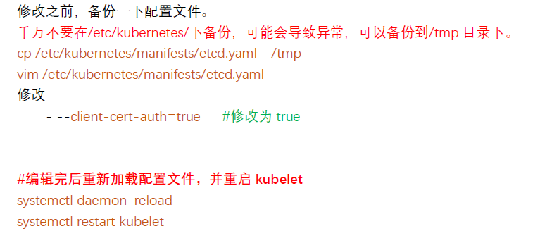
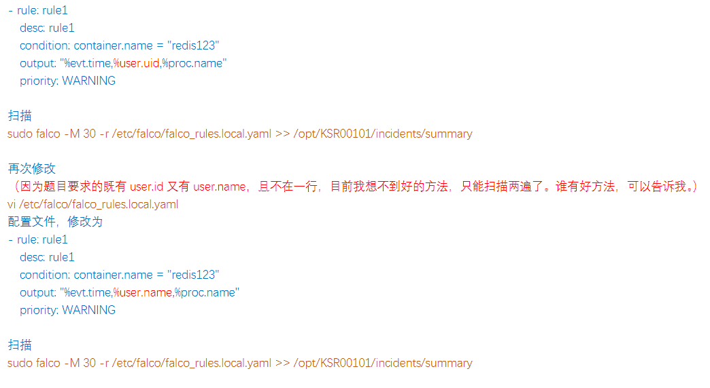
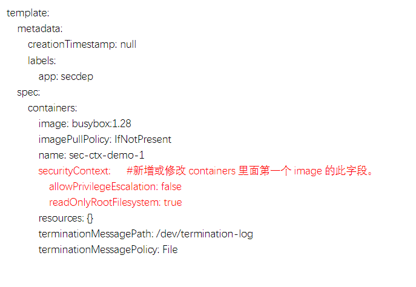

## 1. kube-bench 修复不安全项
参考文档：[依次点击：Tasks -> Run Jobs -> Running Automated Tasks with a CronJob](https://kubernetes.io/docs/reference/config-api/kubelet-config.v1beta1/)

```shell
kubectl config use-context KSCS00201

# 1. 切换到 Master 的 root 下
ssh master01
sudo -i

# sh kube-bench.sh # 模拟

# 2. 修改 api-server
# optional, 利用kube-bench检查
kube-bench master
```


```shell
# 3. 修改 kubelet

# 修复
# 检查 kubelet 配置文件位置。
systemctl status kubelet

#修改
```


```shell
4. 修改etcd
# 可以使用这条命令查。可以不查的，直接按照考试题目里的要求做就行。
kube-bench
```


## 2. Pod 指定 ServiceAccount
参考文档：[ServiceAccount: https://kubernetes.io/docs/tasks/configure-pod-container/configure-service-account/](https://kubernetes.io/docs/tasks/configure-pod-container/configure-service-account/)

```shell
kubectl config use-context KSCH0030

# 1. 创建一个 ServiceAccount
vim qa-ns.yaml
# 根据参考文档修改如下
```


```shell
kubectl apply -f qa-ns.yaml
kubectl get sa -n qa

# 2. 修改已存在的文件，创建一个 Pod使用该 ServiceAccount
vim /cks/sa/pod1.yaml
```


```shell
kubectl apply -f /cks/sa/pod1.yaml
kubectl get pod -n qa

# 3. 删除没有使用的 ServiceAccount
# 查看所有sa
kubectl get sa -n qa
# 查看已经使用sa，例如default和backend-sa已经使用
kubectl get pod -n qa -o yaml | grep -i serviceAccountName
# 删除没有使用的sa
kubectl delete sa test01 -n qa
```

# 3. 默认的NetworkPolicy
参考文档：[NetworkPolicy: https://kubernetes.io/docs/concepts/services-networking/network-policies/](https://kubernetes.io/docs/concepts/services-networking/network-policies/)

```shell
kubectl config use-context KSCS00101

# 可能是ingress或egress或both
vim /cks/net/p1.yaml
```


```shell
kubectl apply -f /cks/net/p1.yaml

# 检查
kubectl describe networkpolicy denypolicy -n testing
```

# 4. RBAC - RoleBinding
参考文档：[RBAC Authorization: https://kubernetes.io/docs/reference/access-authn-authz/rbac/#role-and-clusterole](https://kubernetes.io/docs/reference/access-authn-authz/rbac/#role-and-clusterole)

```shell
kubectl config use-context KSCH00201

# 查看 ServiceAccount service-account-web 对应的 rolebindings role-1-binding
# 查看 rolebindings role-1-binding 对应的 role 为 role-1
kubectl describe rolebindings -n db

# 编辑 role-1 权限：
kubectl edit role role-1 -n db
```


```shell
# 检查
kubectl describe role role-1 -n db

# 在 db 命名空间，创建名为 role-2 的 role，并且通过 rolebinding 绑定 service-account-web，只允许对 namespaces 做 delete 操作。
# 记住 --verb 是权限，可能考 delete 或者 update 等 --resource 是对象，可能考 namespaces 或者 persistentvolumeclaims 等。
kubectl create role role-2 --verb=delete --resource=namespaces -n db
kubectl create rolebinding role-2-binding --role=role-2 --serviceaccount=db:service-account-web -n db

# 检查
kubectl describe rolebindings -n db
```

# 5. 日志审计 log audit
参考文档：[Auditing: https://kubernetes.io/docs/tasks/debug/debug-cluster/audit/](https://kubernetes.io/docs/tasks/debug/debug-cluster/audit/)

```shell
kubectl config use-context KSCH00601

# 1. 切换到Master的root下
ssh master01
sudo -i

sh log-audit.sh

# 2. 配置审计策略
# 先备份配置文件
# 千万不要在/etc/kubernetes/下备份，可能会导致异常，可以备份到/tmp 目录下。
cp /etc/kubernetes/logpolicy/sample-policy.yaml /tmp
vim /etc/kubernetes/logpolicy/sample-policy.yaml
```


```shell
# 3. 配置master节点的kube-apiserver.yaml
cp /etc/kubernetes/manifests/kube-apiserver.yaml /tmp
vim /etc/kubernetes/manifests/kube-apiserver.yaml

# 等待kube-apiserver自动重启，且恢复正常
# 配置完后保存，当 kube-apiserver.yaml 文件内容有变化时，kube-apiserver 会自动重启。
# 等待 2 分钟后，再检查
kubectl get pod -A
tail /var/log/kubernetes/audit-logs.txt
```

```shell
# (Optional)如果等了 3 分钟，kubectl get pod -A 还是报错，可以重启一下 kubelete 服务
systemctl daemon-reload
systemctl restart kubelet


# 退出 root，退回到 candidate@master01
exit
# 退出 master01，退回到 candidate@node01
exit

```

# 6. 创建Secret
参考文档：[Decoding Secret: https://kubernetes.io/docs/tasks/configmap-secret/managing-secret-using-kubectl/#decoding-secret](https://kubernetes.io/docs/tasks/configmap-secret/managing-secret-using-kubectl/#decoding-secret)
参考文档：[Create Secret: https://kubernetes.io/docs/tasks/configmap-secret/managing-secret-using-kubectl/#create-a-secret](https://kubernetes.io/docs/tasks/configmap-secret/managing-secret-using-kubectl/#create-a-secret)
参考文档：[Using Secret: https://kubernetes.io/docs/concepts/configuration/secret/#using-secrets](https://kubernetes.io/docs/concepts/configuration/secret/#using-secrets)

```shell
kubectl config use-context KSCH00701

# 1. 将 db1-test 的 username 和 password，通过 base64 解码保存到题目指定文件
kubectl get secrets db1-test -n istio-system -o jsonpath={.data}
# 会反馈结果为：{"password":"aGVsbG8=","username":"ZGIx"}
echo 'ZGIx'|base64 -d > /cks/sec/user.txt
echo 'aGVsbG8='|base64 -d > /cks/sec/pass.txt

# 检查
cat /cks/sec/user.txt
cat /cks/sec/pass.txt

# 2. 创建名为 db2-test 的 secret 使用题目要求的用户名和密码作为键值。注意要加命名空间
kubectl create secret generic db2-test -n istio-system --from-literal=username=production-instance --from-literal=password=KvLftKgs4aVH

# 检查
kubectl get secret -n istio-system

# 3. 根据题目要求，参考官网，创建 Pod 使用该 secret
vim k8s-secret.yaml

```


```shell
# 创建
kubectl apply -f k8s-secret.yaml
# 检查
kubectl get pod -n istio-system
```


# 7. Dockerfile 检测
参考文档：[Dockerfile: https://kubernetes.io/docs/concepts/security/pod-security-standards/#restricted](https://kubernetes.io/docs/concepts/security/pod-security-standards/#restricted)

```shell
# 1. 修改Dockerfile
vim /cks/docker/Dockerfile
# 仅将 CMD 上面的 USER root 修改为 USER nobody，不需要改其他的 USER root。
USER nobody
# 修改基础镜像为题目要求的 ubuntu:16.04
FROM ubuntu:16.04

# 2. 修改deployment.yaml
vim /cks/docker/deployment.yaml

# template 里标签跟上面的内容不一致，所以需要将原先的 run: couchdb 修改为 app: couchdb
app: couchdb
# 确保 'privileged': 为 False ，确保'readonlyRootFilesystem': 为 True，确保'runAsUser': 为 65535
```

# 8. Sandbox运行容器gVisor
参考文档：[gVisor: https://kubernetes.io/docs/concepts/containers/runtime-class/#2-create-the-corresponding-runtimeclass-resources](https://kubernetes.io/docs/concepts/containers/runtime-class/#2-create-the-corresponding-runtimeclass-resources)

```shell
kubectl config use-context KSMV00301

# 1. 创建一个 RuntimeClass
vim /cks/gvisor/rc.yaml

# 修改或添加如下内容
apiVersion: node.k8s.io/v1
kind: RuntimeClass
metadata:
  name: untrusted # 用来引用 RuntimeClass 的名字，RuntimeClass 是一个集群层面的资源
handler: runsc # 对应的 CRI 配置的名称

# 创建
kubectl create -f /cks/gvisor/rc.yaml
# 检查
kubectl get RuntimeClass

# 2. 将命名空间为 server 下的 Pod 引用 RuntimeClass
# 查看发现3个deploy
kubectl -n server get deployment

# 编辑 deployment
kubectl -n server edit deployments busybox-run
kubectl -n server edit deployments nginx-host
kubectl -n server edit deployments run-test
```


```shell
# 检查 pod
kubectl -n server get pod
```

# 9. NetworkPolicy
参考文档：[NetworkPolicy: https://kubernetes.io/docs/concepts/services-networking/network-policies/#networkpolicy-resource](https://kubernetes.io/docs/concepts/services-networking/network-policies/#networkpolicy-resource)

```shell
kubectl config use-context KSSH00301

# 1. 检查namespace标签
kubectl get ns --show-labels

# 查看 pod 标签（environment: testing）
kubectl get pod -n dev-team --show-labels


# 2. 创建 NetworkPolicy
vim /cks/net/po.yaml
```


```shell
# 创建
kubectl apply -f /cks/net/po.yaml

# 检查
kubectl get networkpolicy -n dev-team
```

# 10. Trivy扫描镜像安全漏洞
参考文档：[Trivy: https://kubernetes.io/docs/reference/kubectl/cheatsheet/](https://kubernetes.io/docs/reference/kubectl/cheatsheet/)

```shell
# kubectl config use-context KSSC00401

# 1. 切换到Master的candidate下
ssh master01

# 2. 获取namespace kamino 下的所有pod和其image的对应关系
kubectl get pods --namespace kamino --output=custom-columns="NAME:.metadata.name,IMAGE:.spec.containers[*].image"
# 或
kubectl describe pod -n kamino |grep -iE '^Name:|Image:'

# 3. 检查镜像是否有高危和严重的漏洞
trivy image -s HIGH,CRITICAL nginx:1.19 # HIGH,CRITICAL，这里的 nginx:1.19 换成你上一步查出来的镜像名字
# 或者也可以使用这条命令查询 trivy image nginx:1.19 | grep -iE 'High|Critical'

# 注意 tri222 和 tri333 的 2 个 pod 里各有 2 个 image，都需要扫描。
trivy image -s HIGH,CRITICAL amazonlinux:1
trivy image -s HIGH,CRITICAL amazonlinux:2
trivy image -s HIGH,CRITICAL nginx:1.19
trivy image -s HIGH,CRITICAL vicuu/nginx:host

# 4. 删除有问题的pod
kubectl delete pod tri111 -n kamino

# 5. 退出 root，退回到 candidate@node01
exit
```

# 11. AppArmor
参考文档：[AppArmor: https://kubernetes.io/docs/tutorials/security/apparmor/#example](https://kubernetes.io/docs/tutorials/security/apparmor/#example)

```shell
kubectl config use-context KSSH00401

# 1. 切换到node02的root下
ssh node02
sudo -i

# 2. 切换到apparmor的目录
cd /etc/apparmor.d/
cat nginx_apparmor

# 3. 执行apparmor策略模块
# 没有 grep 到，说明没有启动。 #这个 nginx-profile-3 是/etc/apparmor.d/nginx_apparmor 里的配置的名字，即第一行 profile 后面紧跟的单词。
apparmor_status | grep nginx-profile-3
# 加载启用这个配置文件
apparmor_parser /etc/apparmor.d/nginx_apparmor
# 再次检查有结果了
apparmor_status | grep nginx-profile-3
# 显示如下内容
nginx-profile-3
# 4. 修改 pod 文件
# 退出 root，退回到 candidate@node02
exit
# vim /cks/KSSH00401/nginx-deploy.yaml
修改如下内容
```


```shell
# 创建
kubectl apply -f /cks/KSSH00401/nginx-deploy.yaml
# 检查
kubectl get pod
# 可以通过检查该配置文件的 proc attr 来验证容器是否实际使用该配置文件运行：
kubectl exec podx -- cat /proc/1/attr/current
```

# 12. Sysdig & falco
参考文档：[Sysdig: https://falco.org/docs/reference/rules/supported-fields/](https://falco.org/docs/reference/rules/supported-fields/)

```shell
kubectl config use-context KSSC00401

# 1. 切换到node02的root下
ssh node02
sudo -i

# 2. 确认题目里所要求 Pod 的唯一标识，比如 ContainerID
crictl ps | grep redis123

# 3. 编辑falco规则
vim /etc/falco/falco_rules.local.yaml
```


```shell
# 4. 查看保存的文件
cat /opt/KSR00101/incidents/summary
# 退出 root，退回到 candidate@node02
exit
# 退出 node02，退回到 candidate@node01
exit
```

# 13. Container安全上下文
参考文档：[SecurityContext: https://kubernetes.io/docs/tasks/configure-pod-container/security-context/](https://kubernetes.io/docs/tasks/configure-pod-container/security-context/)

```shell
kubectl config use-context KSMV00102

# 按照题目要求，在线修改
kubectl -n sec-ns edit deployment secdep
```



# 14 TLS安全配置
参考文档：[kube-apiserver: https://kubernetes.io/docs/reference/command-line-tools-reference/kube-apiserver/](https://kubernetes.io/docs/reference/command-line-tools-reference/kube-apiserver/)

```shell
# 1. 切换到Master的root下
ssh master01
sudo -i

# 2. 修改kube-apiserver
# 修改之前，备份一下配置文件。
# 千万不要在/etc/kubernetes/下备份，可能会导致异常，可以备份到/tmp 目录下。
cp /etc/kubernetes/manifests/kube-apiserver.yaml /tmp
vim /etc/kubernetes/manifests/kube-apiserver.yaml

# 添加或修改相关内容，并保存
    - --tls-cipher-suites=TLS_AES_128_GCM_SHA256
    - --tls-min-version=VersionTLS13 

# 3. 等待kube-apiserver自动重启，且恢复正常
# 检查 kube-apiserver，确保 Running
kubectl -n kube-system get pod

# 4. 修改etcd
# 修改之前，备份一下配置文件。
# 千万不要在/etc/kubernetes/下备份，可能会导致异常，可以备份到/tmp 目录下。
cp /etc/kubernetes/manifests/etcd.yaml /tmp
vim /etc/kubernetes/manifests/etcd.yaml
# 添加或修改相关内容，并保存
    - --cipher-suites=TLS_ECDHE_RSA_WITH_AES_128_GCM_SHA256

# 5. 等待etcd自动重启，且恢复正常
# 检查一下所有 pod，特别是 etcd 和 kube-apiserver 两个 pod
kubectl -n kube-system get pod

# 退出 root，退回到 candidate@master01
exit
# 退出 master01，退回到 candidate@node01
exit
```

# 15 启用API server认证
参考文档：[kube-apiserver: https://kubernetes.io/docs/reference/command-line-tools-reference/kube-apiserver/](https://kubernetes.io/docs/reference/command-line-tools-reference/kube-apiserver/)

```shell
# 1. 切换到Master的root下
ssh master01
sudo -i

sh api.sh

# 2. 确保只有认证并且授权过的 REST 请求才被允许
# 编辑/etc/kubernetes/manifests/kube-apiserver.yaml，修改下面内容
- --authorization-mode=AlwaysAllow
- --enable-admission-plugins=AlwaysAdmit
- --anonymous-auth=true
vim /etc/kubernetes/manifests/kube-apiserver.yaml
```


```shell
# 3. 等待kube-apiserver自动重启，且恢复正常
# 配置完后保存，当 kube-apiserver.yaml 文件内容有变化时，kube-apiserver 会自动重启
# 如果超过 5 分钟没有恢复，表示改错了
kubectl get pod -A

# 4. 删除相应的角色绑定
# 检查
kubectl get clusterrolebinding system:anonymous
# 删
kubectl delete clusterrolebinding system:anonymous
# 再检查
kubectl get clusterrolebinding system:anonymou

# 退出 root，退回到 candidate@master01
exit
# 退出 master01，退回到 candidate@node01
exit

# 最后验证
kubctl get ClusterRoleBinding system:anonymous --kubeconfig /etc/kubernetes/admin.conf
less /etc/kubernetes/manifets/kube-apiserver.yaml
```

# 16. ImagePolicyWebhook容器镜像扫描
参考文档：[Adminssion Controllers: https://kubernetes.io/docs/reference/access-authn-authz/admission-controllers/](https://kubernetes.io/docs/reference/access-authn-authz/admission-controllers/)
参考文档：[ImagePolicyWebhook: https://kubernetes.io/docs/reference/access-authn-authz/admission-controllers/#imagepolicywebhook](https://kubernetes.io/docs/reference/access-authn-authz/admission-controllers/#imagepolicywebhook)

```shell
# 1. 切换到Master的root下
ssh master01
sudo -i

sh imagePolicy.sh

# 2. 编辑 admission_configuration.json（题目会给这个目录），修改 defaultAllow 为 false
vim /etc/kubernetes/epconfig/admission_configuration.json

……
"denyTTL": 50,
"retryBackoff": 500,
"defaultAllow": false #将 true 改为 false
……

# 3. 编辑/etc/kubernetes/epconfig/kubeconfig.yml, 添加webhook server地址
# 操作前，先备份配置文件
# 千万不要在/etc/kubernetes/下备份，可能会导致异常，可以备份到/tmp 目录下。
cp /etc/kubernetes/epconfig/kubeconfig.yml /tmp
vi /etc/kubernetes/epconfig/kubeconfig.yml
修改如下内容
……
certificate-authority: /etc/kubernetes/epconfig/server.crt
server: https://image-bouncer-webhook.default.svc:1323/image_policy #添加 webhook server 地址
name: bouncer_webhook
……

# 4. 编辑kube-apiserver.yaml，添加如下内容
# 操作前，先备份配置文件
# 千万不要在/etc/kubernetes/下备份，可能会导致异常，可以备份到/tmp 目录下。
cp /etc/kubernetes/manifests/kube-apiserver.yaml /tmp
vim /etc/kubernetes/manifests/kube-apiserver.yaml
# 在- command:下修改或添加如下内容，注意空格要对齐（不建议放到最后，建议放置的位置详见下方截图）
- --enable-admission-plugins=NodeRestriction,ImagePolicyWebhook #注意先搜索，如果存在则修改，比如模拟环境里已经有了，但不全，需要修改。
- --admission-control-config-file=/etc/kubernetes/epconfig/admission_configuration.json

# 5. 等待kube-apiserver自动重启，且恢复正常
kubectl -n kube-system get pod
# 通过尝试部署易受攻击的资源 /cks/img/web1.yaml 来测试配置是否有效
kubectl apply -f /cks/img/web1.yaml

# 6. 退回到原 ssh 终端
# 退出 root，退回到 candidate@master01
exit
# 退出 master01，退回到 candidate@node01
exit
```
