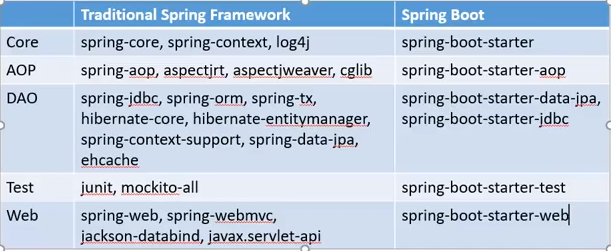

## Spring and Spring Boot
> Spring 5.x, Spring Boot 2.x，所有管理的事情Spring Boot用一个很简单的包来帮你管理所有别的包，二者是一回事，Spring Boot相比原生的Spring主要有3个优点：
>* Simplify dependencies
>* Simplify all bean configurations
>* Spring Boot has built-in servers like Tomcat and Jetty

> Spring从四方面来掌握 ：
>* IoC Container
>* Spring how to manages all beans
>* Spring Proxy
>* Spring is an Integrator

> 具体模块组件
>* Spring IoC: Inversion of Control (IoC与DI - Setter Injection and Constructor Injection，如何配置DI - xml configuration/annotation/stereotype like @Componet)
>* Spring AOP: Aspect-Oriented Programming
>* Spring DAO: Data Access Object
>* Spring ORM: MyBatis or JPA (JPA是DAO层的抽象)
>* Sping MVC
>* Spring REST
>* Spring Security

1. Scope features in Spring IoC

    Scope: singleton, prototype, request, session, globalSession. prototype is a shallow copy.

2. Autowire features in Spring IoC

    Autowire: no, byname, byType, constructor, autodetect

3. How to inject a singleton in Spring IoC?

    Set factory-method=”getInstance”. Otherwise, it will create more than one object.

4. Difference between BeanFactory and ApplicationContext?

    ApplicationContext is more powerful than BeanFactory. Each bean in BeanFactory is lazy-loaded by default, but not lazy-loaded in ApplicationContext. To make a bean lazy-loaded in ApplicationContext, we can set lazy-init=”true”.

5. Difference advices in Spring AOP

    Intercept around, before, after returning, after throwing, after

6. Workflow of Spring MVC

7. Three mappings in Spring MVC

    - SimpleUrlHandlerMapping
    - BeanNameUrlHandlerMapping
    - CommonsHandlerMapping

8. How to handle multiple submit buttons in Spring MVC?

    Use MultiActionController

9. How does Spring integrate with Struts? Three ways:

    * Use ActionSupport instead of Action

    * Add a controller in struts-config.xml file and the controller is DelegatingRequestProcessor

    * Change the type of each action to DeletaingActionProxy

10. Spring Transaction Management.

    Spring framework provides a generic abstraction layer for transaction management. This allowing the developer to add the pluggable transaction managers, and making it easy to demarcate transactions without dealing with low-level issues. Spring's transaction support is not tied to J2EE environments and it can be also used in container less environments.

11. Spring Application Contexts

    There are three well known Application Context in Spring used to Bean wiring.

    Types of Application Contexts:
    
        * ClassPathXmlApplicationContext
            Loads a context definition from an XML file located in the classpath, treating context definition files as classpath resources.
        * FileSystemXmlApplicationContext
            Loads a context definition from an XML file in the file system.
        * XmlWebApplicationContext
            Loads context definitions from an XML file contained within a web application.
